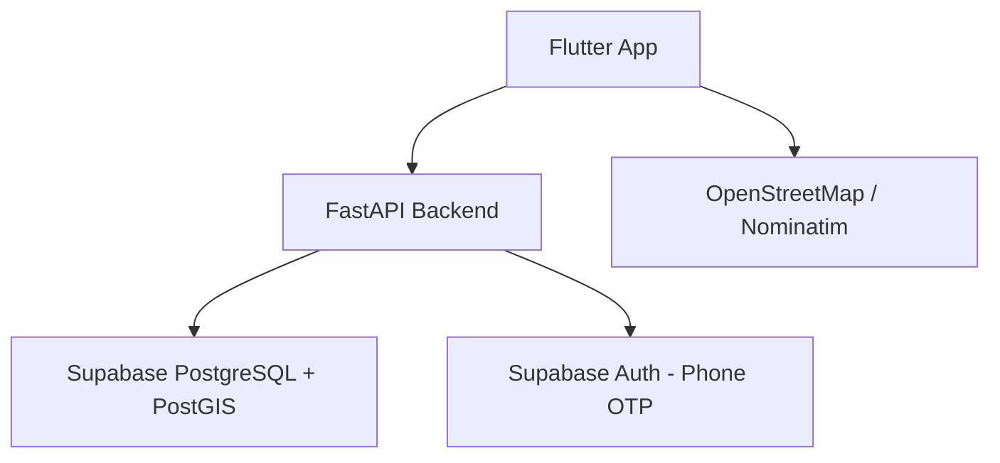
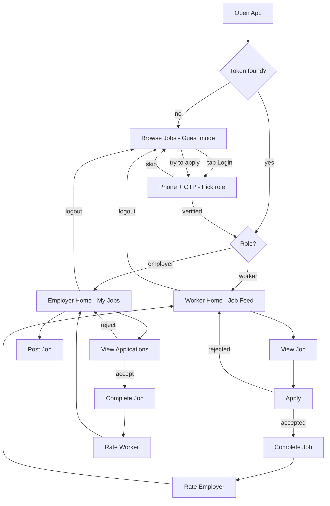

# Daily Wage Worker Job Board

A **mobile-first job marketplace** connecting **daily wage workers** (construction, cleaning, delivery) with **employers offering short-term or urgent work**.

Built for the people usually left out by mainstream job apps:

- 📱 **Low-end Android devices** — APK target < 15 MB, lazy-loaded images, paginated feeds
- 🌐 **Slow / unreliable internet** — local Hive cache with a stale-data banner when offline
- 🔤 **Low-literacy users** — icon-driven UX, colour-coded status badges, large tap targets (≥ 48 dp)

---

## Features

- **Phone OTP auth** — no passwords; short-lived JWT (15 min) + rotating 30-day refresh token
- **Role-based flows** — workers browse & apply, employers post & hire; roles enforced server-side
- **Location-aware job feed** — nearby jobs via PostGIS `ST_DWithin` geo queries
- **Application lifecycle** — apply → accept / reject / withdraw, one application per worker per job
- **Bidirectional reviews** — workers and employers rate each other after a job completes
- **Guest browsing** — explore jobs before signing up; login prompted only on apply
- **In-app notifications** — written synchronously on relevant events

---

## Tech Stack

| Layer        | Technology |
|--------------|-----------|
| **Frontend** | Flutter (Dart), Android-first |
| **State**    | Riverpod |
| **Backend**  | FastAPI (Python 3.11+), async REST |
| **Database** | Supabase — PostgreSQL 15 + PostGIS |
| **Auth**     | Phone OTP (Supabase Auth) + JWT (JWKS RS256/ES256) |
| **Maps**     | OpenStreetMap tiles (`flutter_map`) + Nominatim geocoding |
| **Rate limit** | slowapi (60 req/min global, 10/min on `/auth/*`) |

Key Flutter packages: `flutter_riverpod`, `dio`, `hive_flutter`, `go_router`, `geolocator`, `flutter_map`, `cached_network_image`, `flutter_secure_storage`, `intl`.

---

## System Architecture



## User Flow



---

## Project Structure

```
backend/app/
  routers/      # auth, users, workers, employers, jobs,
                # applications, reviews, notifications, categories
  schemas/      # Pydantic models per domain
  services/     # auth, job, application, notification services
  config.py     # Settings (pydantic-settings)
  dependencies.py  # get_current_user — JWT + JWKS decode
  main.py       # FastAPI app factory
backend/supabase/migrations/   # SQL schema, indexes, triggers, seed

dailywork/lib/
  core/         # api config, dio client, router, theme
  models/       # user, job, category models
  providers/    # Riverpod state
  repositories/ # abstract data access (jobs, users, auth, reviews)
  screens/      # auth/, worker/, employer/, browse/, shared/
```

### Data model (8 tables)

`users`, `worker_profiles`, `employer_profiles`, `jobs`, `applications`, `reviews`, `notifications`, `categories`.

Location stored as `GEOGRAPHY` with a GIST index; jobs feed indexed on `(status, created_at)`; one-application-per-job enforced by a unique constraint.

---

## Getting Started

### Backend

```bash
cd backend
pip install -r requirements.txt
cp .env.example .env        # fill in Supabase keys
uvicorn app.main:app --reload --port 8000
```

API docs at `http://localhost:8000/docs` (development only).

### Database

```bash
# Apply migrations from backend/supabase/migrations/ to your Supabase project.
# PostGIS is required:  CREATE EXTENSION postgis;
```

### Flutter app

```bash
cd dailywork
flutter pub get
flutter run        # point api_config.dart at your backend URL
```

### Tests

```bash
cd backend  && pytest -v
cd dailywork && flutter test && flutter analyze
```

---

## API Overview

All routes prefixed `/api/v1`; auth via `Authorization: Bearer <jwt>`.

| Router | Key endpoints |
|--------|---------------|
| `/auth` | `send-otp`, `verify-otp`, `refresh`, `setup-profile` |
| `/users` | `GET /me`, `PATCH /me`, `GET /{id}/reviews` |
| `/workers` · `/employers` | `GET/PATCH /me/profile`, `GET /{user_id}/profile` |
| `/jobs` | feed, create, detail, update, delete, `apply`, applications, status |
| `/reviews` · `/notifications` · `/categories` | rate, list/read, list |

---

## License

See [LICENSE](LICENSE).
